# Reto6
# ST0256 Tópicos Especiales en Telemática

## Estudiante:
- Nombre: David Fonseca Lara
- Correo: dfonsecal@eafit.edu.co

## Profesor:
- Nombre: Álvaro Ospina
- Correo: aeospinas@eafit.edu.co

# Reto 6 - Hive y Spark
## Cluster de Amazon EMR
Estoy usando un cluster de Amazon EMR que para el desarrollo de este reto. El cluster fue creado con las indicaciones del
[Lab 0](https://github.com/st0263eafit/st0263-241/blob/main/bigdata/00-lab-aws-emr/Install-AWS-EMR.pdf)

1.Primero creé en el HDFS la carpeta donde iban a estar los datos en el CSV
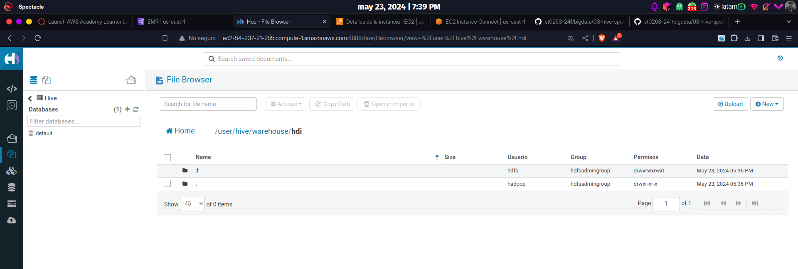

2. Subí el archivo CSV en el HDFS para ser leído en por Hive
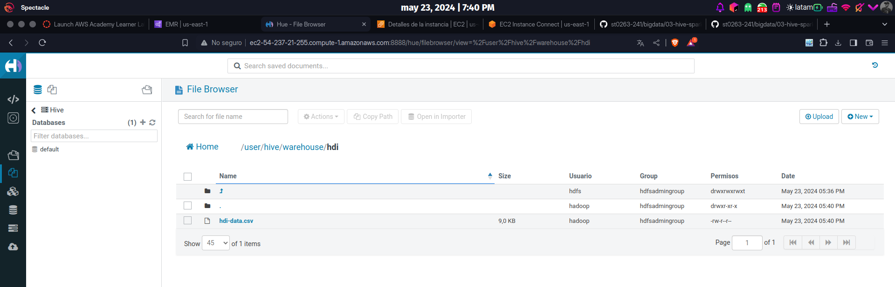

3. Creé la tabla interna en Hive con los datos en HDFS
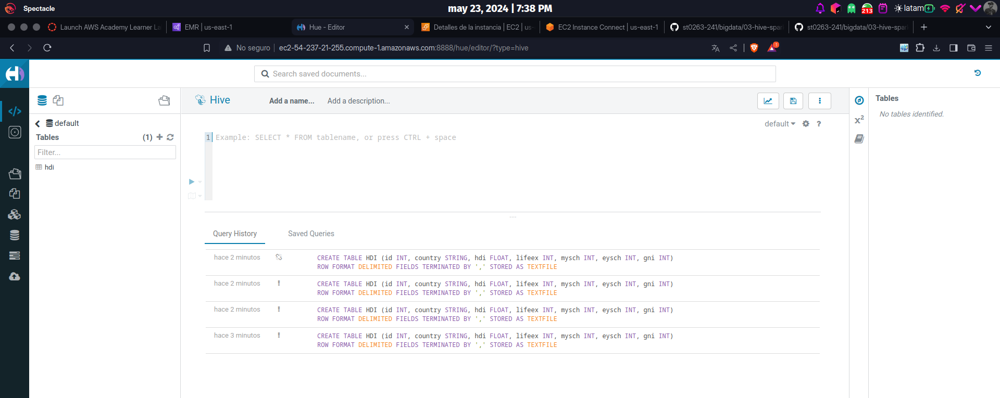

4. Esta es una vista de la tabla hdi que son los datos del CSV en el S3 observados desde el Hive
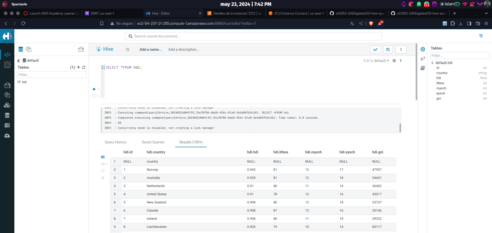

5. Subí el archivo CSV en el S3 para ser leído en por Hive
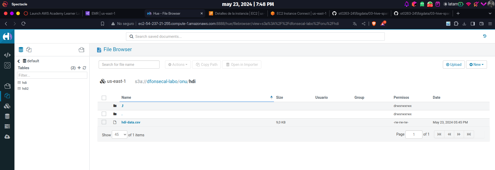

6. Creé la tabla externa en Hive con los datos en S3
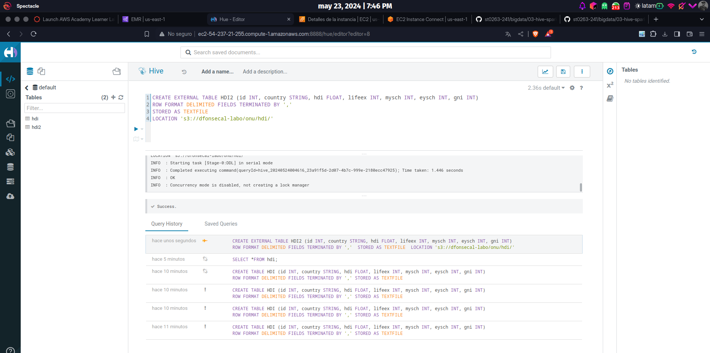

7. Esta es una vista de la tabla hdi2 que son los datos del CSV en el S3 observados desde el Hive
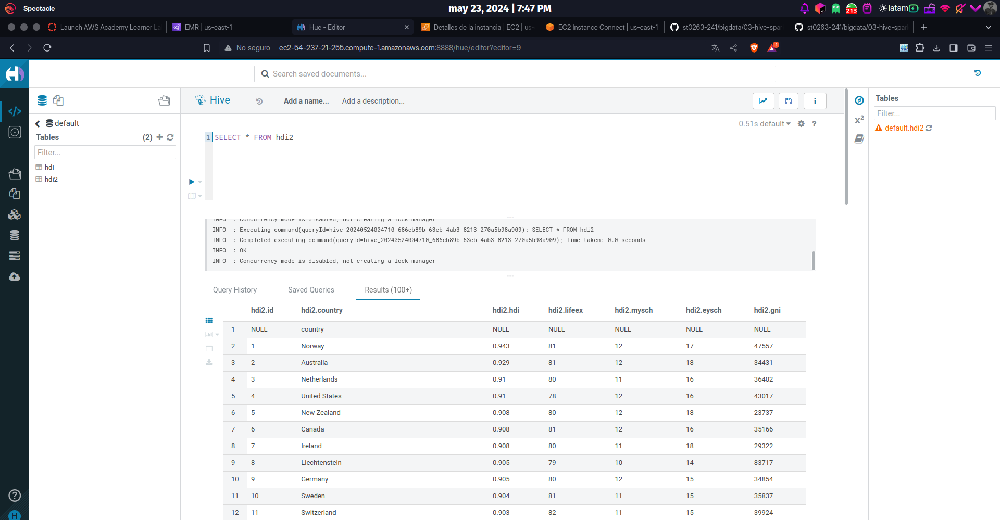

8. Cree una tabla para otro CSV (export) alojada en el S3
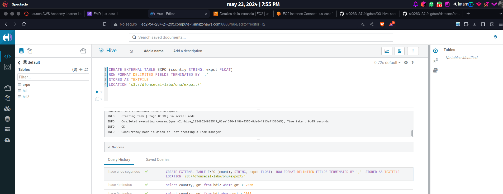

9. Hice las consultas del tutorial
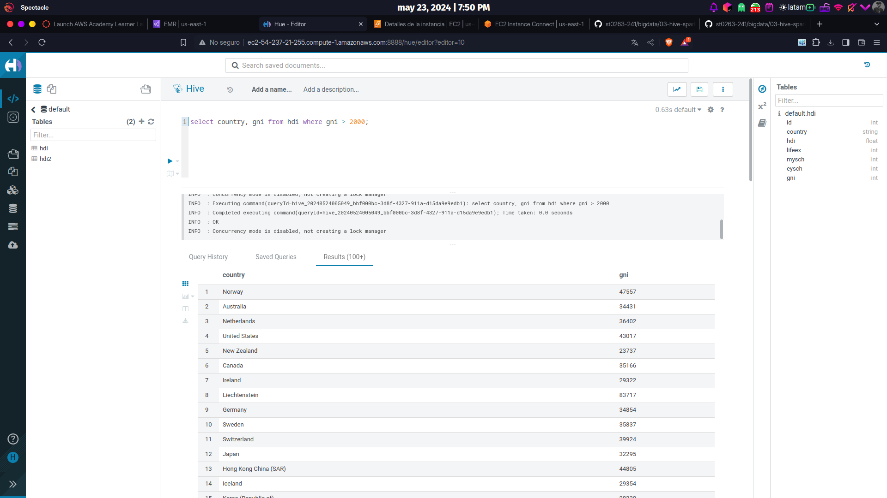
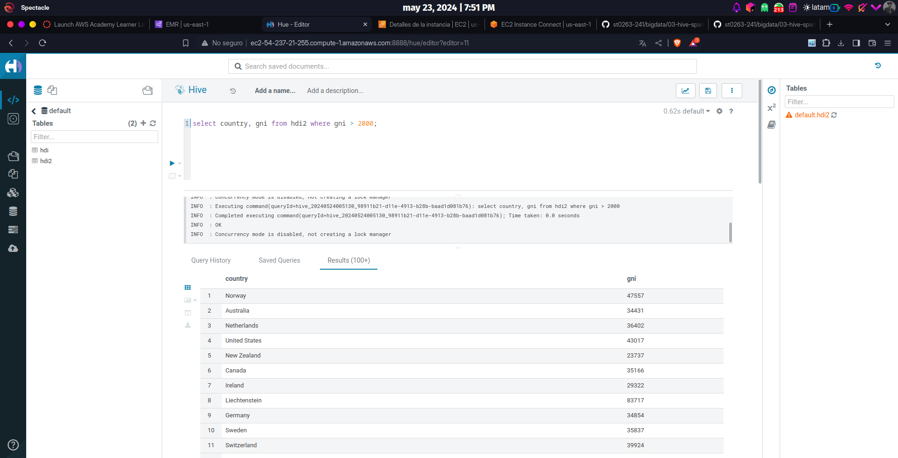
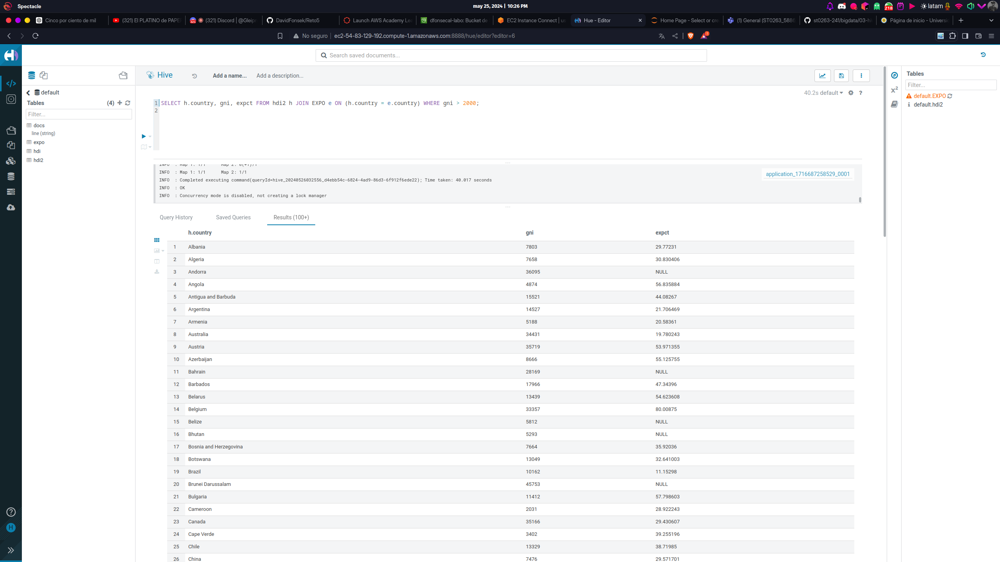

10. Cree una tabla llamada docs en Hive con archivos almacenados en S3, los cuales eran unos .txt
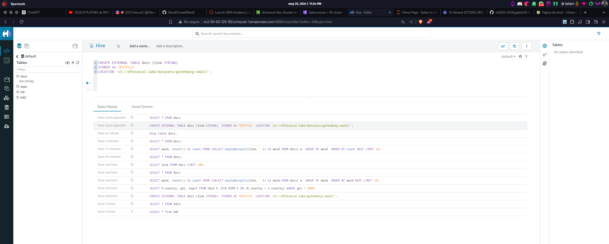

11. Esta es una vista de los datos de la tabla docs con los datos en el S3 observados desde el Hive
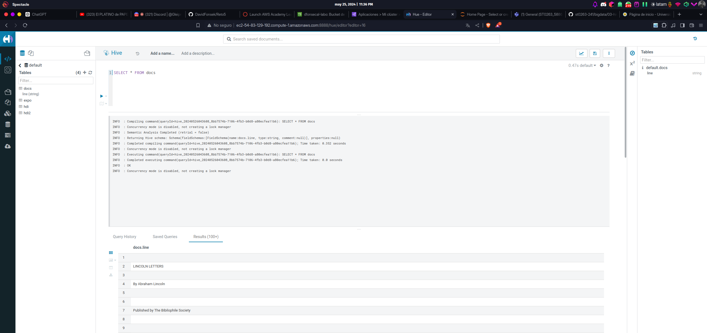

12. Estas son las consultas de la tabla docs propuestas por el tutorial
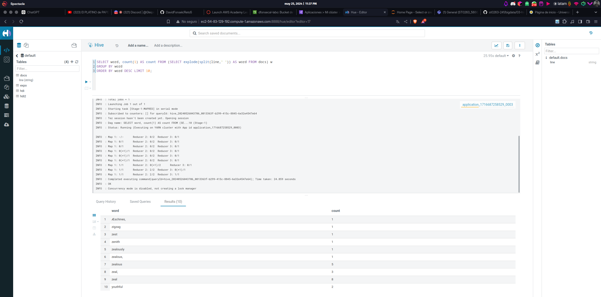
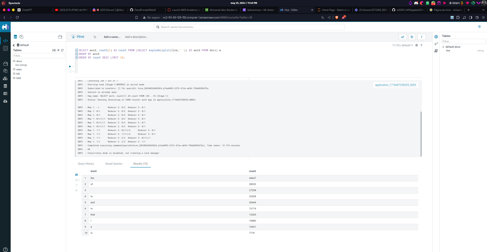

13. Por ultimo resolví el reto propuesto en el tutorial
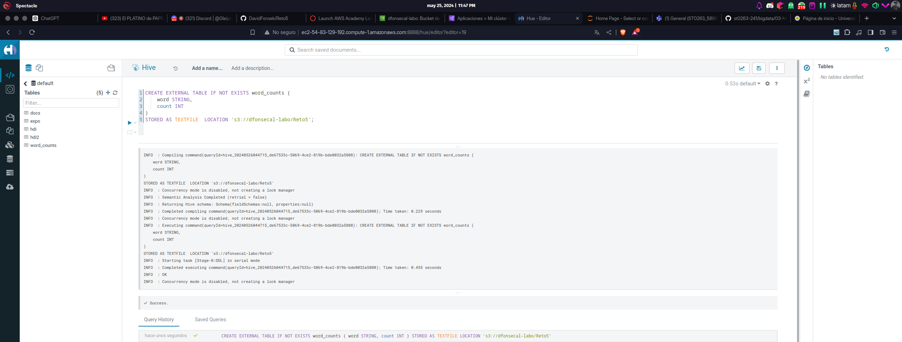
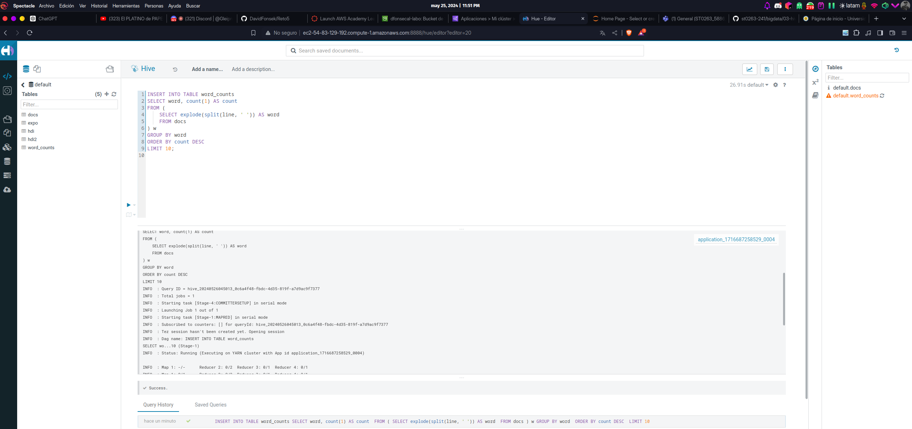
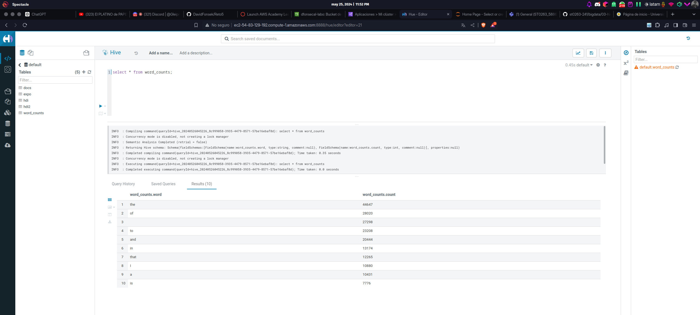
